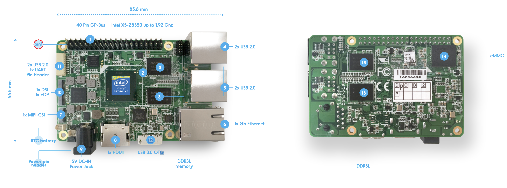
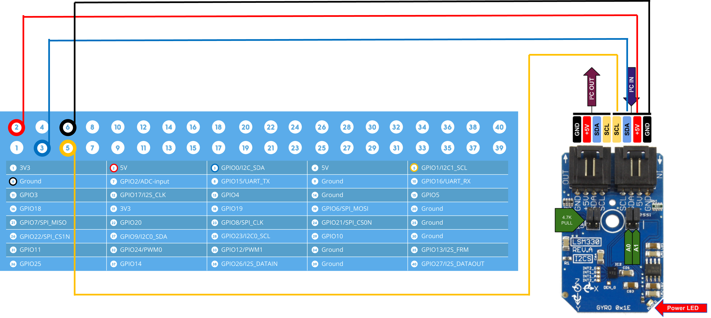

## Notes from Estelle

### Testing I2C connection [UpBoard/LSM.py].
Connect LSM330 Input end to Upboard.

Upbaord layout:


Pinout:


Demo of I2C connection:


Reference: UpBoard DataSheet: https://up-board.org/wp-content/uploads/datasheets/UPDatasheetV8.5.pdf


To enable user to I2C port:
```
ubuntu@ubuntu-UP-CHT01:~$ sudo add-apt-repository ppa:up-division/5.4-upboard
ubuntu@ubuntu-UP-CHT01:~/Documents/EE292D_Project$ sudo apt update
ubuntu@ubuntu-UP-CHT01:~/Documents/EE292D_Project/UpBoard$ ./up_extras_setup.sh
```
./up_extras_setup.sh is created based on reference: Section "Enable the HAT functionality from userspace" on [UpBoard Wiki](https://github.com/up-board/up-community/wiki/Ubuntu_18.04)

```
ubuntu@ubuntu-UP-CHT01:~$ i2cdetect -y -r 1
     0  1  2  3  4  5  6  7  8  9  a  b  c  d  e  f
00:                         -- -- -- -- -- -- -- --
10: -- -- -- -- -- -- -- -- -- -- -- -- -- -- 1e --
20: -- -- -- -- -- -- -- -- -- -- -- -- -- -- -- --
30: -- -- -- -- -- -- -- -- -- -- -- -- -- -- -- --
40: -- -- -- -- -- -- -- -- -- -- -- -- -- -- -- --
50: -- -- -- -- -- -- -- -- -- -- -- -- -- -- -- --
60: -- -- -- -- -- -- -- -- -- -- 6a -- -- -- -- --


ubuntu@ubuntu-UP-CHT01:~/Documents/LSM330/Python$ sudo apt install python3-pip

ubuntu@ubuntu-UP-CHT01:~/Documents/LSM330/Python$ sudo apt-get install python3-smbus

ubuntu@ubuntu-UP-CHT01:~/Documents/LSM330/Python$ python3 LSM330.py
Acceleration in X-Axis : 0.190814
Acceleration in Y-Axis : 0.372057
Acceleration in Z-Axis : 10.028797

```


### Testing dependencies in loading .pkl model [log_reg.py].
```
ubuntu@ubuntu-UP-CHT01:~/Documents/EE292D_Project$ sudo apt-get install python3-numpy

ubuntu@ubuntu-UP-CHT01:~/Documents/EE292D_Project$ sudo apt-get install python3-sklearn

ubuntu@ubuntu-UP-CHT01:~/Documents/EE292D_Project$ python3 log_reg.py
```


### Setting up SSH

```
On the Upboard:
ubuntu@ubuntu-UP-CHT01:~/Documents/EE292D_Project/UpBoard$ sudo apt -y install openssh-server
```

In file /etc/ssh/sshd_config
```
# Change to no to disable tunnelled clear text passwords
PasswordAuthentication no
```

Then in the terminal, run
```
service ssh restart
```

### Main Script for fall detection [fall_prediction.py]
```
ubuntu@ubuntu-up-cht01:~/Documents/EE292D_Project/UpBoard$ python3 fall_prediction.py
```
